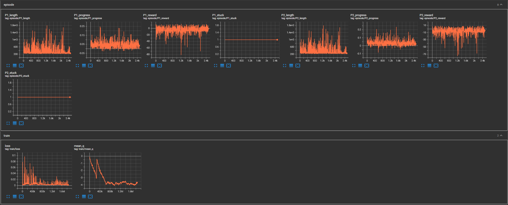

# Run 3 — Frame Stacking

## Configuration
- Frame stacking: 4 frames (new)
- Input channels: 4
- Target net update: every 1000 steps
- Replay buffer: 100k
- Learning rate: 1e-4

## Duration
- ~2500 episodes, one Dolphin freeze interruption at episode 367

## Observations
- mean_q stabilized around -4, no divergence
- Progress delta showed no clear upward trend
- Rewards hovering around 0 to -10 with no improvement
- All episodes ended stuck as expected

## Conclusion
- Frame stacking added no measurable overhead
- No behavioral improvement after 2500 episodes
- Reward function likely too complex for early training — conflicting penalties cancel progress signal
- Next step: simplify reward to pure forward progress, no penalties 