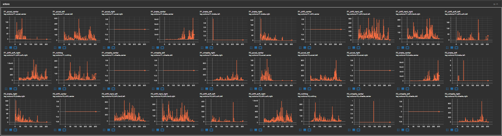
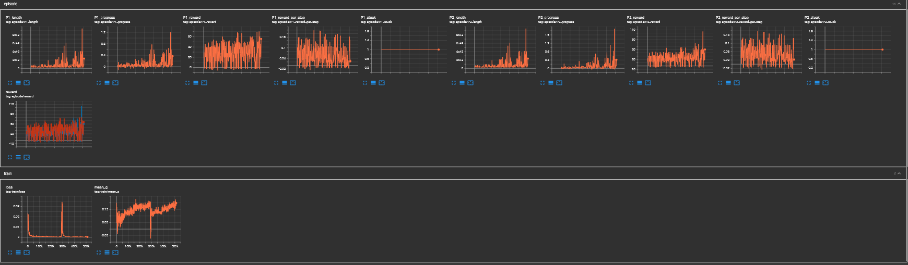

# Run 6 — Throwaway (Poor Early Exploration)

## Issue
Started from a fresh model after deleting run 5 weights. Random weight initialization combined with insufficient early exploration caused the network to converge to a narrow action subset within the first few episodes, ignoring actions like `accel_center` almost entirely despite it being the correct primary action.

## Root Cause
NoisyLinear sigma values are too low at initialization, so the deterministic weight component dominates early and the network collapses to a local policy before meaningful exploration has occurred.

## Fixes for Next Run
- Increase initial NoisyLinear sigma from `0.5 * bound` to `1.0 * bound`
- Switch to advanced reward function with stuck penalty and wall/offroad penalties

