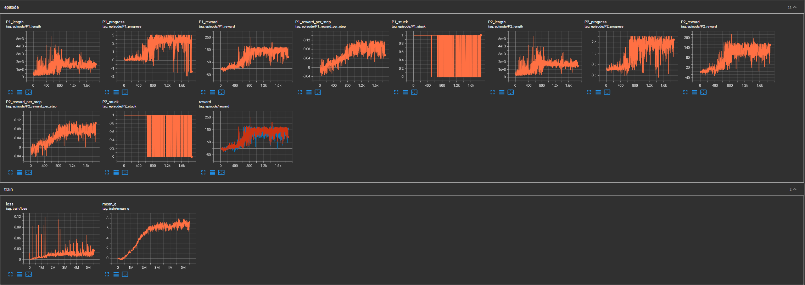
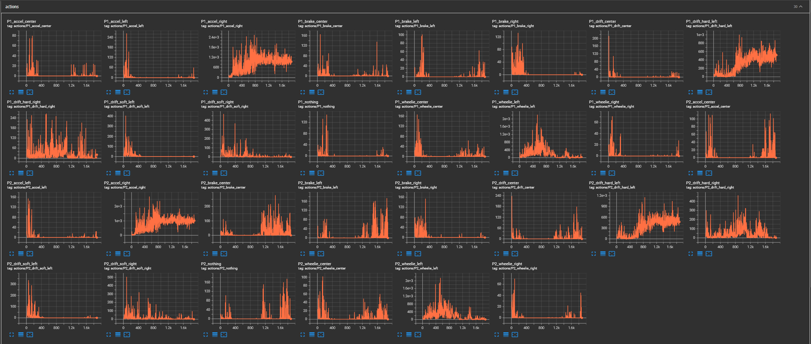

# Run 7 — Advanced Reward Function + Improved Exploration

## Configuration
- Advanced reward function with wall, offroad, respawn penalties and stuck/finish bonuses
- Epsilon-greedy exploration added (1.0 → 0.0 over 10,000 steps) on top of NoisyLinear
- Replay buffer: 20k
- Optimizer frequency: every 64 steps
- Curriculum: LC only for first 3000 episodes (to be adjusted)

## Observations
- All 15 actions used from the start — exploration fix worked
- Agent consistently finishing full 3-lap races from ~episode 800 onward
- mean_q rising strongly to ~7-8, best across all runs
- Reward trending upward throughout, reaching 150+ per episode
- Agent navigates track geometry without explicit track knowledge
- Primarily uses `accel_right` and `drift_hard_left` — steers constantly rather than driving straight
- `accel_center` rarely used despite LC having long straight sections
- Reward plateaued around episode 1000-2000 on LC

## Current Status at Handoff (~2000 episodes, ~5.7M steps)
- Consistently finishing races but slower than in-game hard CPU opponents
- Only one player per episode because game cuts off last driver after second to last finishes.

## Thoughts for Further Training
- Curriculum thresholds too conservative — introducing new tracks much earlier to break LC plateau
- Buffer save/load to be added to avoid mean_q dip on restart
- May need to increase speed bonus in reward to incentivize faster driving
- Add new save states with easy cpu
- Goal: beat CPU on all tracks